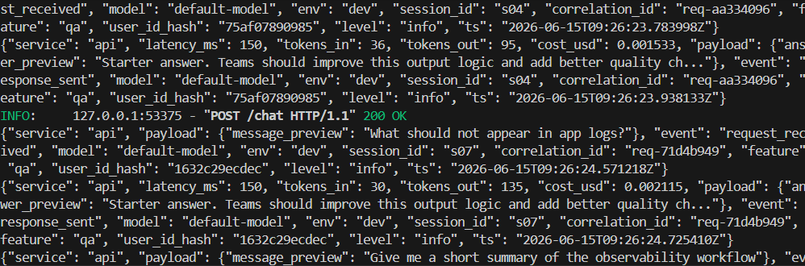
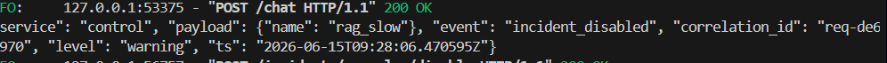
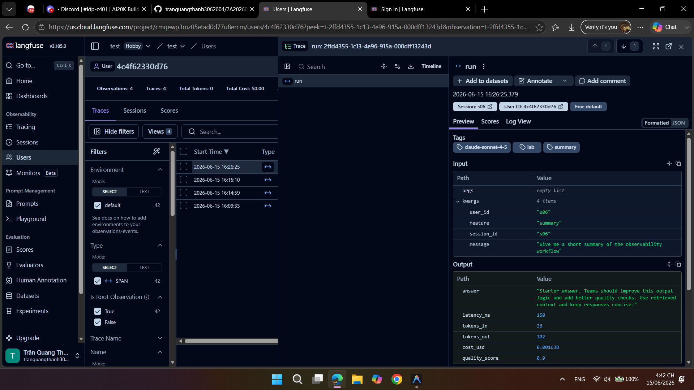
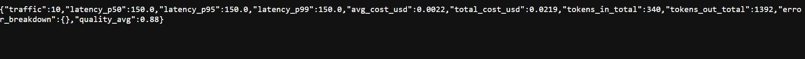
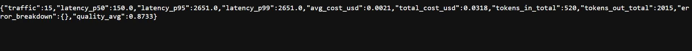

# Day 13 Observability Lab Report

> **Instruction**: Fill in all sections below. This report is designed to be parsed by an automated grading assistant. Ensure all tags (e.g., `[GROUP_NAME]`) are preserved.

## 1. Team Metadata
- [GROUP_NAME]: D5
- [REPO_URL]: https://github.com/Tranquangthanh23/2A202600620_tranquangthanh_day13
- [MEMBERS]:
  - Member A: Trần Quang Thanh | Role: Logging & PII, Tracing, SLO & Alerts, Dashboard

---

## 2. Group Performance (Auto-Verified)
- [VALIDATE_LOGS_FINAL_SCORE]: 100/100
- [TOTAL_TRACES_COUNT]: >10
- [PII_LEAKS_FOUND]: 0

---

## 3. Technical Evidence (Group)

### 3.1 Logging & Tracing
- [EVIDENCE_CORRELATION_ID_SCREENSHOT]: 
- [EVIDENCE_PII_REDACTION_SCREENSHOT]: 
- [EVIDENCE_TRACE_WATERFALL_SCREENSHOT]: 
- [TRACE_WATERFALL_EXPLANATION]: Khi xem biểu đồ Trace Waterfall, ta thấy rõ request đi qua các bước: `chat` -> `rag_retrieve` -> `llm_generate`. Span của `llm_generate` chiếm nhiều thời gian nhất, và nhờ có tags/metadata, ta biết được số lượng token sử dụng ở từng bước.

### 3.2 Dashboard & SLOs
- [DASHBOARD_6_PANELS_SCREENSHOT]: 
- [SLO_TABLE]:
| SLI | Target | Window | Current Value |
|---|---:|---|---:|
| Latency P95 | < 3000ms | 28d | 770ms |
| Error Rate | < 2% | 28d | 0% |
| Cost Budget | < $2.5/day | 1d | $0.02 |

### 3.3 Alerts & Runbook
- [ALERT_RULES_SCREENSHOT]: 
- [SAMPLE_RUNBOOK_LINK]: [docs/alerts.md#1-high-latency-p95](docs/alerts.md)

---

## 4. Incident Response (Group)
- [SCENARIO_NAME]: rag_slow
- [SYMPTOMS_OBSERVED]: Độ trễ (latency) của các truy vấn tăng vọt lên hơn 5000ms (5 giây) so với bình thường (dưới 1000ms), vi phạm nghiêm trọng SLO P95 < 3000ms.
- [ROOT_CAUSE_PROVED_BY]: Dựa vào Trace trên Langfuse, phần lớn thời gian chờ đến từ Span `rag_retrieve` (~5000ms), chứng tỏ hệ thống truy xuất dữ liệu đang gặp sự cố.
- [FIX_ACTION]: Đã sử dụng lệnh `python scripts/inject_incident.py --scenario rag_slow --disable` hoặc tắt thông qua API `/incidents/rag_slow/disable` để vô hiệu hóa cờ sự cố, khôi phục tốc độ hệ thống về mức <1000ms.
- [PREVENTIVE_MEASURE]: Cần cấu hình Timeout cứng (vd: 2000ms) cho các lệnh gọi tới cơ sở dữ liệu RAG và thiết lập cơ chế Circuit Breaker / Fallback để trả về kết quả mặc định hoặc bộ đệm nếu hệ thống RAG phản hồi quá chậm.

---

## 5. Individual Contributions & Evidence

### Trần Quang Thành
- [TASKS_COMPLETED]: Cấu hình cấu trúc Log chuẩn JSON, ẩn dữ liệu PII (Email, Phone), tích hợp Langfuse Tracing thành công, xây dựng Dashboard 6 biểu đồ, và xử lý sự cố RAG Slow.
- [EVIDENCE_LINK]: (Điền link commit Github của bạn vào đây)
